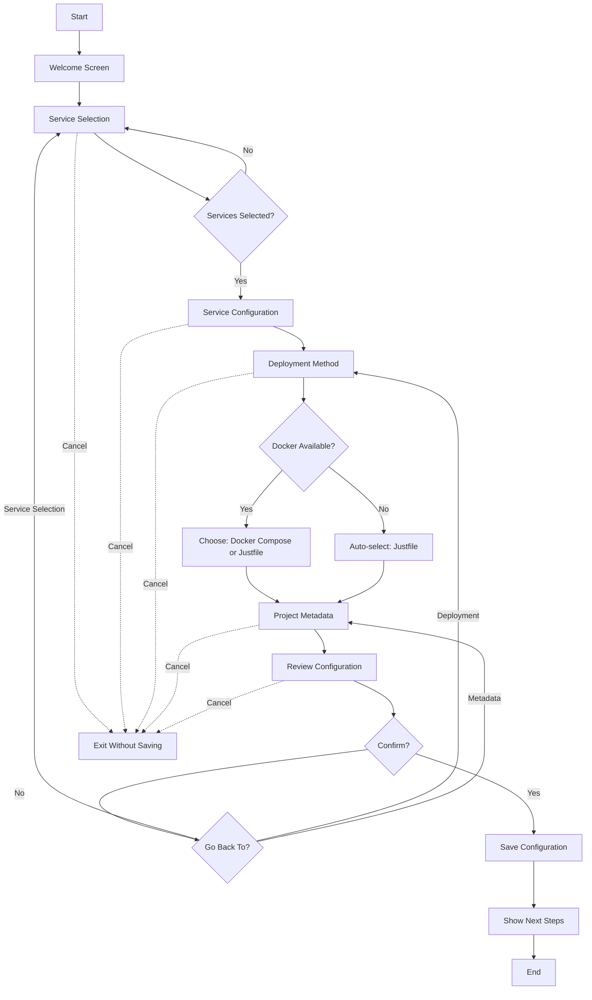

# Task 4.1: Design Wizard Flow and UX

**Agent**: frontend-developer **Duration**: 4 hours **Status**: READY TO START **Parallel**: Can run alongside Task 4.2A

## Mission

Design the complete wizard flow with state machine, decision trees, and UX patterns for the Mycelium onboarding wizard.
Create a clear, accessible, and user-friendly experience that guides users from detection to configuration.

## Context

### Dependencies Complete

- ✅ M01 Environment Isolation (xdg_dirs, env_validator, config_loader)
- ✅ M02 Configuration System (schema, manager, migrations)
- ✅ M03 Service Detection (orchestrator, detectors, caching)

### Your Role

You are designing the user experience for the PRIMARY touchpoint of Mycelium setup. This wizard transforms complex
infrastructure choices into an accessible, guided experience for developers of all skill levels.

### Integration Points

- **Input**: DetectionResults from M03 (Docker, Redis, Postgres, Temporal, GPU status)
- **Output**: MyceliumConfig saved via M02 ConfigManager
- **Storage**: XDG directories from M01

## Requirements

### Wizard Flow Sequence

Design 7 screens in this order:

1. **Welcome Screen**

   - Display detection summary (table format)
   - Show system capabilities found
   - Confirm user ready to begin
   - Set expectations (5-minute wizard)

1. **Service Selection**

   - Checkbox selection: Redis, PostgreSQL, Temporal, TaskQueue
   - Pre-check based on detection
   - Show recommendations (e.g., "Redis detected and running")
   - Validate: At least one service must be selected

1. **Service Configuration**

   - Configure each selected service
   - For Redis: port, persistence, max_memory
   - For PostgreSQL: port, database name, max_connections
   - For Temporal: UI port, frontend port, namespace
   - Use detected values as defaults
   - Validate port ranges (1-65535)

1. **Deployment Method**

   - Select: Docker Compose (recommended) or Justfile
   - If Docker not available: auto-select Justfile
   - Explain implications of each choice
   - Show what will be generated

1. **Project Metadata**

   - Project name (validate: alphanumeric, hyphens, underscores)
   - Project description (optional)
   - Defaults: name="mycelium", description="Multi-agent coordination"

1. **Configuration Review**

   - Display final configuration (table format)
   - Show all selections
   - Confirm to save or go back to edit

1. **Finalization**

   - Success message with config location
   - Next steps: generate deployment, start services
   - Commands to run next

### State Machine Design

Create `mycelium_onboarding/wizard/flow.py` with:

```python
"""Wizard flow design and orchestration."""

from enum import Enum
from typing import Optional
from dataclasses import dataclass, field

class WizardStep(str, Enum):
    """Wizard step enumeration."""
    WELCOME = "welcome"
    SERVICE_SELECTION = "service_selection"
    SERVICE_CONFIG = "service_config"
    DEPLOYMENT_METHOD = "deployment_method"
    PROJECT_METADATA = "project_metadata"
    REVIEW = "review"
    FINALIZE = "finalize"


@dataclass
class WizardState:
    """Maintains state across wizard steps."""
    current_step: WizardStep
    detection_results: Optional['DetectionResults'] = None
    selected_services: set[str] = field(default_factory=set)
    service_configs: dict[str, dict] = field(default_factory=dict)
    deployment_method: Optional[str] = None
    project_name: str = "mycelium"
    project_description: str = "Multi-agent coordination system"
    config: Optional['MyceliumConfig'] = None

    def can_proceed(self) -> bool:
        """Validate if current step is complete and can proceed."""
        if self.current_step == WizardStep.SERVICE_SELECTION:
            return len(self.selected_services) > 0
        elif self.current_step == WizardStep.SERVICE_CONFIG:
            # All selected services must be configured
            return all(svc in self.service_configs for svc in self.selected_services)
        elif self.current_step == WizardStep.DEPLOYMENT_METHOD:
            return self.deployment_method is not None
        elif self.current_step == WizardStep.PROJECT_METADATA:
            return bool(self.project_name)
        elif self.current_step == WizardStep.REVIEW:
            return self.config is not None
        return True

    def next_step(self) -> Optional[WizardStep]:
        """Determine next step in flow."""
        steps = list(WizardStep)
        try:
            current_idx = steps.index(self.current_step)
            if current_idx < len(steps) - 1:
                return steps[current_idx + 1]
        except ValueError:
            pass
        return None

    def previous_step(self) -> Optional[WizardStep]:
        """Determine previous step for back navigation."""
        steps = list(WizardStep)
        try:
            current_idx = steps.index(self.current_step)
            if current_idx > 0:
                return steps[current_idx - 1]
        except ValueError:
            pass
        return None


def create_wizard_state(detection_results: 'DetectionResults') -> WizardState:
    """Initialize wizard state with detection results.

    Args:
        detection_results: Results from M03 service detection

    Returns:
        Initialized WizardState ready to start wizard flow
    """
    return WizardState(
        current_step=WizardStep.WELCOME,
        detection_results=detection_results,
        selected_services=set(),
    )
```

### UX Principles

**Progressive Disclosure**

- Don't overwhelm users with all options at once
- Show relevant options based on previous choices
- Hide advanced options unless requested

**Intelligent Defaults**

- Use detection results to pre-fill values
- Recommend based on what's available
- Make the "happy path" obvious

**Clear Communication**

- Consistent terminology throughout
- Clear error messages with solutions
- Contextual help available at each step

**Safety & Confidence**

- Review step before finalizing
- Show what will happen before doing it
- Allow going back to change choices
- Graceful exit at any point

**Accessibility**

- Keyboard-only navigation
- Screen reader friendly prompts
- Clear visual hierarchy
- No reliance on color alone

### Error Handling Patterns

**Validation Errors**

- Validate immediately (don't wait until submit)
- Show specific error message
- Suggest valid alternatives
- Don't lose user's work

**System Errors**

- Detection failures: explain and continue
- Save failures: show path to fix
- Permission errors: provide commands to fix
- Interruption: save state for resume

**User Cancellation**

- Ctrl+C at any point: graceful exit
- Confirm if significant progress made
- Don't write partial configuration
- Clean up any temporary state

## Deliverables

### 1. Flow Implementation

**File**: `mycelium_onboarding/wizard/flow.py`

Contents:

- WizardStep enum
- WizardState dataclass
- create_wizard_state() function
- Navigation methods (next_step, previous_step)
- Validation method (can_proceed)
- Comprehensive docstrings

### 2. Flow Diagram

**File**: `docs/projects/onboarding/M04_wizard_flow.md`

Create visual flow using Mermaid:



Or ASCII art if Mermaid not available:

```
[Start] → [Welcome] → [Service Selection] → [Service Config]
              ↓              ↓ (validate)           ↓
           Detection      At least 1           All services
            Summary       selected?             configured?
                                                      ↓
                                              [Deployment Method]
                                                      ↓
                                              Docker available?
                                                   ↙     ↘
                                        Yes: Choose   No: Auto
                                             method    Justfile
                                                   ↘     ↙
                                              [Project Metadata]
                                                      ↓
                                              [Review & Confirm]
                                                      ↓
                                                  Confirm?
                                                   ↙     ↘
                                              Yes       No: Back
                                               ↓
                                          [Save Config]
                                               ↓
                                          [Next Steps]
                                               ↓
                                             [End]

(User can Cancel/Ctrl+C at any step → Exit without saving)
```

### 3. UX Design Document

**File**: `docs/projects/onboarding/M04_ux_design.md`

Include:

- User personas (beginner, intermediate, advanced)
- Use cases and scenarios
- Screen-by-screen UX specifications
- Interaction patterns
- Accessibility checklist
- Color scheme and formatting guidelines
- Example dialog flows

### 4. State Transition Table

**File**: Documentation in `flow.py` or separate design doc

| Current Step      | User Action     | Validation       | Next Step         | Error State     |
| ----------------- | --------------- | ---------------- | ----------------- | --------------- |
| WELCOME           | Confirm         | None             | SERVICE_SELECTION | N/A             |
| SERVICE_SELECTION | Select services | ≥1 selected      | SERVICE_CONFIG    | Show error      |
| SERVICE_CONFIG    | Configure each  | All configured   | DEPLOYMENT_METHOD | Prompt missing  |
| DEPLOYMENT_METHOD | Select method   | Method chosen    | PROJECT_METADATA  | N/A             |
| PROJECT_METADATA  | Enter name      | Valid identifier | REVIEW            | Show validation |
| REVIEW            | Confirm         | Config valid     | FINALIZE          | Back to edit    |
| FINALIZE          | Done            | N/A              | Exit              | N/A             |

## Implementation Guidelines

### Code Organization

```
mycelium_onboarding/
└── wizard/
    ├── __init__.py          # Package exports
    ├── flow.py              # State machine (YOUR TASK)
    ├── screens.py           # Screen implementations (Task 4.2B)
    ├── integration.py       # Detection integration (Task 4.3)
    └── persistence.py       # Config saving (Task 4.4)
```

### Type Safety

```python
from typing import Optional, TYPE_CHECKING

if TYPE_CHECKING:
    from mycelium_onboarding.detection.orchestrator import DetectionResults
    from mycelium_onboarding.config.schema import MyceliumConfig
```

### Testing Strategy

You don't need to write tests (python-pro will), but design for testability:

- Pure functions where possible
- Clear state transitions
- No hidden dependencies
- Mockable external calls

## Reference Materials

### M04 Milestone Document

Location: `/home/gerald/git/mycelium/docs/projects/onboarding/milestones/M04_INTERACTIVE_ONBOARDING.md`

Key sections:

- Task 4.1 implementation pattern (lines 56-131)
- Complete requirements (lines 22-53)
- UX principles

### Related Schemas (M02)

```python
# From mycelium_onboarding/config/schema.py
class MyceliumConfig(BaseModel):
    version: Literal["1.0"] = "1.0"
    deployment: DeploymentConfig
    services: ServicesConfig
    project_name: str = "mycelium"

class ServicesConfig(BaseModel):
    redis: RedisConfig
    postgres: PostgresConfig
    temporal: TemporalConfig

class DeploymentConfig(BaseModel):
    method: DeploymentMethod  # "docker-compose" or "justfile"
    auto_start: bool = True
    healthcheck_timeout: int = 60
```

### Detection Results (M03)

```python
# From mycelium_onboarding/detection/orchestrator.py
class DetectionResults:
    docker: DockerInfo      # available, version, running
    redis: RedisInfo        # available, host, port, version
    postgres: PostgresInfo  # available, host, port
    temporal: TemporalInfo  # available, ports
    gpu: GPUInfo            # available, type, count
```

## Quality Standards

### Design Quality

- [ ] Flow covers all user paths (happy + error)
- [ ] State transitions are clear and logical
- [ ] Validation rules prevent invalid states
- [ ] Accessibility requirements documented
- [ ] Error handling comprehensive

### Code Quality

- [ ] mypy --strict passes
- [ ] ruff check passes
- [ ] Comprehensive docstrings
- [ ] Type hints on all functions
- [ ] Clear variable names

### Documentation Quality

- [ ] Flow diagram clear and complete
- [ ] UX design document thorough
- [ ] State transitions documented
- [ ] Examples provided
- [ ] Accessible to reviewers

## Success Criteria

- [ ] WizardState dataclass implemented
- [ ] WizardStep enum defined
- [ ] create_wizard_state() function working
- [ ] can_proceed() validation logic complete
- [ ] next_step() / previous_step() navigation working
- [ ] Flow diagram visual and clear
- [ ] UX design document comprehensive
- [ ] State transition table complete
- [ ] All deliverables created
- [ ] python-pro review approves design

## Timeline

**Hour 0-1**: Study requirements and existing code **Hour 1-2**: Design flow and state machine **Hour 2-3**: Implement
flow.py **Hour 3-4**: Create flow diagram and UX documentation

## Next Steps After Completion

1. Submit deliverables for review
1. python-pro reviews flow design
1. Incorporate feedback if needed
1. Approve for Task 4.2B (screen implementation)
1. Unblock Task 4.3 (detection integration)

## Questions or Blockers?

Escalate to multi-agent-coordinator if:

- Design decisions need clarification
- Requirements conflict or unclear
- Technical blockers discovered
- Need additional context from M01/M02/M03

______________________________________________________________________

**Status**: READY TO START **Agent**: frontend-developer **Estimated Completion**: +4 hours **Next Task**: 4.2A (can run
in parallel)
