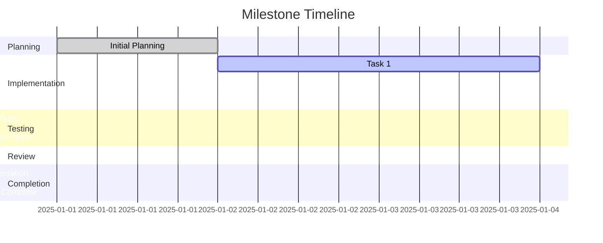
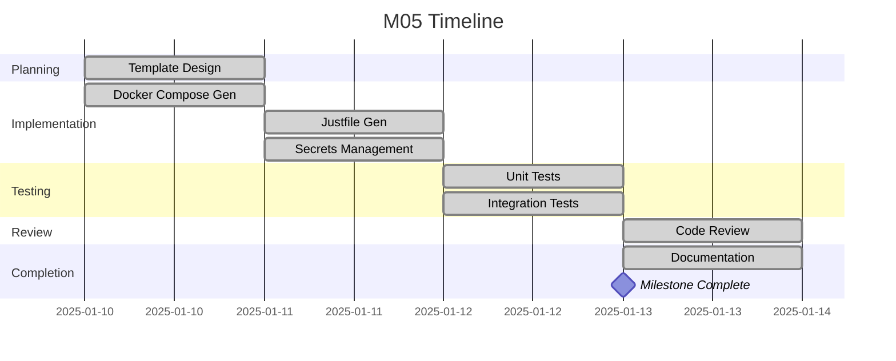

# Milestone Status Template

Use this template to track progress on milestones. Update this document regularly as work progresses.

______________________________________________________________________

## Milestone \[Number\]: \[Milestone Name\]

**Status**: \[Not Started | In Progress | In Review | Completed | Blocked\] **Progress**: \[0-100\]% **Start Date**:
\[YYYY-MM-DD\] **Target Completion**: \[YYYY-MM-DD\] **Actual Completion**: \[YYYY-MM-DD or N/A\]

**Lead Agent**: \[Agent name\] **Support Agents**: \[Agent names\]

### Summary

\[1-2 sentence summary of what this milestone delivers\]

### Current Phase

\[Describe what is currently being worked on\]

______________________________________________________________________

## Task Status

| Task ID    | Task Name     | Status     | Assignee  | Progress   | Notes           |
| ---------- | ------------- | ---------- | --------- | ---------- | --------------- |
| \[M-ID.1\] | \[Task name\] | \[Status\] | \[Agent\] | \[0-100%\] | \[Brief notes\] |
| \[M-ID.2\] | \[Task name\] | \[Status\] | \[Agent\] | \[0-100%\] | \[Brief notes\] |
| \[M-ID.3\] | \[Task name\] | \[Status\] | \[Agent\] | \[0-100%\] | \[Brief notes\] |
| \[M-ID.4\] | \[Task name\] | \[Status\] | \[Agent\] | \[0-100%\] | \[Brief notes\] |
| \[M-ID.5\] | \[Task name\] | \[Status\] | \[Agent\] | \[0-100%\] | \[Brief notes\] |

**Task Status Legend**:

- **Not Started**: Work has not begun
- **In Progress**: Currently being worked on
- **In Review**: Implementation complete, under review
- **Completed**: Reviewed and merged
- **Blocked**: Waiting on dependency or blocker

______________________________________________________________________

## Progress Metrics

### Completion by Category

- **Implementation**: \[X/Y tasks\] (\[Z%\])
- **Testing**: \[X/Y tasks\] (\[Z%\])
- **Documentation**: \[X/Y tasks\] (\[Z%\])
- **Review**: \[X/Y tasks\] (\[Z%\])

### Time Tracking

- **Estimated Effort**: \[Hours\] hours
- **Actual Effort**: \[Hours\] hours
- **Efficiency**: \[Percentage\] (actual/estimated)

### Quality Metrics

- **Test Coverage**: \[Percentage\]
- **Code Review Status**: \[X/Y tasks reviewed\]
- **Documentation Completeness**: \[Complete | Partial | Missing\]

______________________________________________________________________

## Blockers & Issues

| ID      | Description             | Severity           | Assigned To | Status                          | Resolution               |
| ------- | ----------------------- | ------------------ | ----------- | ------------------------------- | ------------------------ |
| \[B-1\] | \[Blocker description\] | \[High\|Med\|Low\] | \[Agent\]   | \[Open\|In Progress\|Resolved\] | \[How resolved or plan\] |

**Severity Levels**:

- **High**: Blocks all progress on milestone
- **Medium**: Blocks specific tasks but others can proceed
- **Low**: Causes delays but has workaround

______________________________________________________________________

## Exit Criteria Progress

Check off criteria as they are met:

### Functional Criteria

- [ ] \[Criterion 1 from milestone document\]
- [ ] \[Criterion 2 from milestone document\]
- [ ] \[Criterion 3 from milestone document\]

### Technical Criteria

- [ ] \[Technical criterion 1\]
- [ ] \[Technical criterion 2\]
- [ ] \[Technical criterion 3\]

### Quality Criteria

- [ ] All tests passing
- [ ] Code coverage ≥\[target\]%
- [ ] Documentation complete
- [ ] Code reviewed and approved

______________________________________________________________________

## Dependencies

### Upstream Dependencies (Blocking this milestone)

| Milestone | Status     | Expected Completion | Impact if Delayed      |
| --------- | ---------- | ------------------- | ---------------------- |
| \[M-ID\]  | \[Status\] | \[Date\]            | \[Impact description\] |

### Downstream Dependencies (Blocked by this milestone)

| Milestone | Waiting On         | Impact if Delayed      |
| --------- | ------------------ | ---------------------- |
| \[M-ID\]  | \[What they need\] | \[Impact description\] |

______________________________________________________________________

## Risk Assessment

### Active Risks

| Risk                 | Likelihood         | Impact             | Mitigation Status           |
| -------------------- | ------------------ | ------------------ | --------------------------- |
| \[Risk description\] | \[Low\|Med\|High\] | \[Low\|Med\|High\] | \[In place\|Planned\|None\] |

### Realized Issues

| Issue                   | Impact                         | Resolution              | Lessons Learned     |
| ----------------------- | ------------------------------ | ----------------------- | ------------------- |
| \[Issue that occurred\] | \[Impact on timeline/quality\] | \[How it was resolved\] | \[What we learned\] |

______________________________________________________________________

## Timeline

______________________________________________________________________

## Change Log

### \[YYYY-MM-DD\]

- **Changed**: \[What changed\]
- **Reason**: \[Why it changed\]
- **Impact**: \[Effect on timeline/scope\]

### \[YYYY-MM-DD\]

- **Completed**: \[Task or criterion completed\]
- **Next Steps**: \[What comes next\]

______________________________________________________________________

## Notes

\[Any additional context, decisions made, alternative approaches considered\]

______________________________________________________________________

## Example Usage

Below is a completed example of this template in use:

______________________________________________________________________

## Milestone 05: Deployment Generation

**Status**: Completed **Progress**: 100% **Start Date**: 2025-01-10 **Target Completion**: 2025-01-13 **Actual
Completion**: 2025-01-13

**Lead Agent**: python-pro **Support Agents**: devops-engineer, test-automator

### Summary

Implement deployment file generators that transform MyceliumConfig into executable infrastructure (Docker Compose files
and Justfiles) with proper secrets management.

### Current Phase

All tasks completed. Milestone in final review stage.

______________________________________________________________________

## Task Status

| Task ID | Task Name                 | Status    | Assignee        | Progress | Notes                           |
| ------- | ------------------------- | --------- | --------------- | -------- | ------------------------------- |
| M05.1   | Design Jinja2 templates   | Completed | python-pro      | 100%     | Templates validated             |
| M05.2   | Docker Compose generator  | Completed | python-pro      | 100%     | Unit tests passing              |
| M05.3   | Justfile generator        | Completed | devops-engineer | 100%     | Platform-specific logic working |
| M05.4   | Secrets management        | Completed | python-pro      | 100%     | Cryptographically secure        |
| M05.5   | Slash command integration | Completed | python-pro      | 100%     | /mycelium-generate working      |

**Task Status Legend**:

- All tasks completed and reviewed

______________________________________________________________________

## Progress Metrics

### Completion by Category

- **Implementation**: 5/5 tasks (100%)
- **Testing**: 5/5 tasks (100%)
- **Documentation**: 5/5 tasks (100%)
- **Review**: 5/5 tasks (100%)

### Time Tracking

- **Estimated Effort**: 22 hours
- **Actual Effort**: 24 hours
- **Efficiency**: 92% (slight overrun due to additional security hardening)

### Quality Metrics

- **Test Coverage**: 95%
- **Code Review Status**: 5/5 tasks reviewed
- **Documentation Completeness**: Complete

______________________________________________________________________

## Blockers & Issues

| ID  | Description                                     | Severity | Assigned To | Status   | Resolution                          |
| --- | ----------------------------------------------- | -------- | ----------- | -------- | ----------------------------------- |
| B-1 | Template validation required custom YAML parser | Medium   | python-pro  | Resolved | Implemented custom validation logic |

**Severity Levels**: No active blockers

______________________________________________________________________

## Exit Criteria Progress

All criteria met ✓

### Functional Criteria

- [x] Docker Compose generator produces valid YAML
- [x] Justfile generator produces valid Just syntax
- [x] Secrets generated securely with cryptographic randomness
- [x] /mycelium-generate slash command functional

### Technical Criteria

- [x] Jinja2 templates follow best practices
- [x] Generators validate output before returning
- [x] File permissions set correctly (0644 config, 0600 secrets)

### Quality Criteria

- [x] All tests passing
- [x] Code coverage ≥90% (achieved 95%)
- [x] Documentation complete
- [x] Code reviewed and approved

______________________________________________________________________

## Dependencies

### Upstream Dependencies (Blocking this milestone)

| Milestone | Status    | Expected Completion | Impact if Delayed       |
| --------- | --------- | ------------------- | ----------------------- |
| M02       | Completed | 2025-01-05          | N/A - completed on time |
| M04       | Completed | 2025-01-09          | N/A - completed on time |

### Downstream Dependencies (Blocked by this milestone)

| Milestone | Waiting On                   | Impact if Delayed                                |
| --------- | ---------------------------- | ------------------------------------------------ |
| M06       | Deployment files for testing | Could start with mocks, but real files preferred |
| M10       | Final QA validation          | Would delay release validation                   |

______________________________________________________________________

## Risk Assessment

### Active Risks

No active risks - milestone completed successfully.

### Realized Issues

| Issue                           | Impact                 | Resolution                     | Lessons Learned                               |
| ------------------------------- | ---------------------- | ------------------------------ | --------------------------------------------- |
| YAML validation complexity      | Added 2 hours to M05.1 | Created custom validation      | Should have planned for validation from start |
| macOS Homebrew path differences | Added 1 hour to M05.3  | Platform detection in template | Need better platform testing matrix           |

______________________________________________________________________

## Timeline

______________________________________________________________________

## Change Log

### 2025-01-13

- **Completed**: All exit criteria met
- **Status**: Moved to Completed
- **Next Steps**: M06 can begin

### 2025-01-12

- **Completed**: All tasks implemented and tested
- **Changed**: Added 2 hours for YAML validation complexity
- **Impact**: Still on track for target completion

### 2025-01-11

- **Completed**: Tasks M05.2, M05.3, M05.4
- **Progress**: 80% complete
- **Next Steps**: Slash command integration and final testing

### 2025-01-10

- **Started**: Milestone kickoff
- **Completed**: Task M05.1 (template design)
- **Next Steps**: Begin generator implementation

______________________________________________________________________

## Notes

Milestone completed successfully with minor time overrun (2 hours) due to additional security hardening for secrets
generation. Team performed well, and deliverables exceed quality standards.

Key success factors:

- Clear task breakdown enabled parallel work
- Early template validation caught issues
- Strong collaboration between python-pro and devops-engineer

Recommendations for future milestones:

- Allocate buffer time for validation/hardening
- Include platform-specific testing from the start
- Document edge cases discovered during implementation

______________________________________________________________________

*This template provides comprehensive milestone tracking and should be updated at least daily during active
development.*
