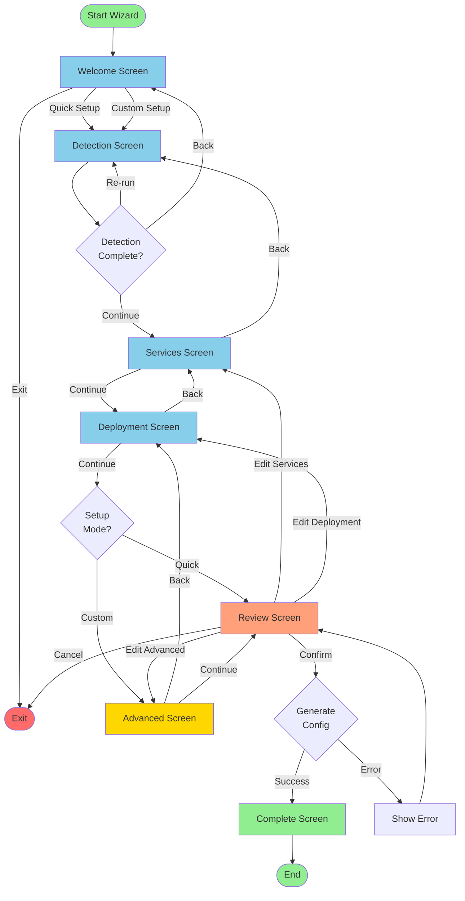

# Wizard Flow Diagram

This document describes the complete flow of the Mycelium interactive onboarding wizard.

## High-Level Flow



## Detailed State Machine

### State Transitions

```
WizardStep Enum:
┌─────────────┐
│   WELCOME   │ (Start)
└──────┬──────┘
       │
       ▼
┌─────────────┐
│  DETECTION  │ (Run detection)
└──────┬──────┘
       │
       ▼
┌─────────────┐
│  SERVICES   │ (Configure services)
└──────┬──────┘
       │
       ▼
┌─────────────┐
│ DEPLOYMENT  │ (Choose method)
└──────┬──────┘
       │
       ├─────────┬─────────┐
       │         │         │
       ▼         ▼         ▼
   Quick?    Custom?    Back?
       │         │         │
       │         ▼         │
       │   ┌─────────┐    │
       │   │ADVANCED │    │
       │   └────┬────┘    │
       │        │         │
       └────────┴─────────┘
                │
                ▼
         ┌─────────────┐
         │   REVIEW    │ (Confirm)
         └──────┬──────┘
                │
                ▼
         ┌─────────────┐
         │  COMPLETE   │ (Success!)
         └─────────────┘
```

## Quick Setup Flow (Simplified)

```
┌───────────┐     ┌────────────┐     ┌──────────┐     ┌────────────┐
│  Welcome  │────▶│ Detection  │────▶│ Services │────▶│ Deployment │
│  (Quick)  │     │  (Auto)    │     │ (Basic)  │     │  (Docker)  │
└───────────┘     └────────────┘     └──────────┘     └─────┬──────┘
                                                             │
                  ┌────────────┐     ┌────────┐            │
                  │  Complete  │◀────│ Review │◀───────────┘
                  │ (Success!) │     │(Quick) │
                  └────────────┘     └────────┘

Time: ~2-3 minutes
Steps: 5 screens (skips ADVANCED)
```

## Custom Setup Flow (Full)

```
┌───────────┐     ┌────────────┐     ┌──────────┐     ┌────────────┐
│  Welcome  │────▶│ Detection  │────▶│ Services │────▶│ Deployment │
│ (Custom)  │     │  (Auto)    │     │  (Full)  │     │  (Choice)  │
└───────────┘     └────────────┘     └──────────┘     └─────┬──────┘
                                                             │
                  ┌────────────┐     ┌────────┐      ┌──────▼──────┐
                  │  Complete  │◀────│ Review │◀─────│  Advanced   │
                  │ (Success!) │     │ (Full) │      │  (Detailed) │
                  └────────────┘     └────────┘      └─────────────┘

Time: ~4-5 minutes
Steps: 7 screens (includes ADVANCED)
```

## Navigation Map

### Forward Navigation

```
WELCOME ──────────────▶ DETECTION
DETECTION ────────────▶ SERVICES
SERVICES ─────────────▶ DEPLOYMENT
DEPLOYMENT ───┬───────▶ REVIEW (Quick)
              └───────▶ ADVANCED (Custom)
ADVANCED ─────────────▶ REVIEW
REVIEW ───────────────▶ COMPLETE
```

### Backward Navigation

```
DETECTION ────────────▶ WELCOME
SERVICES ─────────────▶ DETECTION
DEPLOYMENT ───────────▶ SERVICES
ADVANCED ─────────────▶ DEPLOYMENT (Custom only)
REVIEW ───────────────▶ DEPLOYMENT (Quick)
                     └▶ ADVANCED (Custom)
```

### Jump Navigation (from Review)

```
REVIEW ───┬───────────▶ SERVICES (Edit)
          ├───────────▶ DEPLOYMENT (Edit)
          └───────────▶ ADVANCED (Edit, Custom only)
```

## State Management

### WizardState Fields by Screen

```
WELCOME:
  ✎ setup_mode
  ✎ started_at

DETECTION:
  ✎ detection_results
  ✎ services_enabled (pre-fill)
  ✎ redis_port (pre-fill)
  ✎ postgres_port (pre-fill)
  ✎ temporal_frontend_port (pre-fill)
  ✎ temporal_ui_port (pre-fill)

SERVICES:
  ✎ project_name
  ✎ services_enabled (confirm/edit)
  ✎ redis_port (confirm/edit)
  ✎ postgres_port (confirm/edit)
  ✎ postgres_database
  ✎ temporal_frontend_port (confirm/edit)
  ✎ temporal_ui_port (confirm/edit)

DEPLOYMENT:
  ✎ deployment_method
  ✎ auto_start

ADVANCED:
  ✎ enable_persistence
  ✎ redis_max_memory
  ✎ postgres_max_connections
  ✎ temporal_namespace
  ✎ temporal_history_retention_days

REVIEW:
  ✓ (Read all fields)

COMPLETE:
  ✎ completed = True
```

Legend:

- ✎ = Write (field is set/modified)
- ✓ = Read (field is displayed)

## Decision Points

### Setup Mode Decision (Welcome)

```
? How would you like to proceed?

Quick Setup ────────▶ Skip ADVANCED screen
                    Use smart defaults
                    Faster completion (~2-3 min)

Custom Setup ───────▶ Show ADVANCED screen
                    Full configurability
                    Longer completion (~4-5 min)
```

### Service Selection (Services)

```
? Select services to enable:

At least 1 required ─────▶ Validation passes
                        Continue to DEPLOYMENT

None selected ──────────▶ Validation fails
                        Show error message
                        Stay on SERVICES
```

### Deployment Prerequisites (Deployment)

```
Docker Compose:
  Docker detected? ──────▶ Recommended (green)
  Docker missing? ───────▶ Warning, allow continue

Kubernetes:
  kubectl found? ────────▶ Available
  kubectl missing? ──────▶ Warning, allow continue

systemd:
  systemd detected? ─────▶ Available
  systemd missing? ──────▶ Error, disallow

Manual:
  Always available ──────▶ No prerequisites
```

## Error Handling Flow

```
┌─────────────┐
│  Any Screen │
└──────┬──────┘
       │
       ▼
    Error?
       │
       ├─ Validation Error ──▶ Show inline error
       │                       Stay on screen
       │                       Highlight field
       │
       ├─ System Error ──────▶ Show error dialog
       │                       Offer retry
       │                       Allow go back
       │
       ├─ Network Error ─────▶ Show timeout message
       │                       Offer re-run
       │                       Continue anyway
       │
       └─ Fatal Error ───────▶ Show error details
                               Save state
                               Exit gracefully
```

## Time Estimates

### Per Screen

- **WELCOME**: 15-30 seconds (read + choose)
- **DETECTION**: 2-5 seconds (automatic)
- **SERVICES**: 60-120 seconds (input + configure)
- **DEPLOYMENT**: 30-60 seconds (choose + configure)
- **ADVANCED**: 60-120 seconds (configure details)
- **REVIEW**: 30-60 seconds (read + confirm)
- **COMPLETE**: Read-only (exit when ready)

### Complete Flows

- **Quick Setup**: 2-3 minutes total
- **Custom Setup**: 4-5 minutes total
- **Edit from Review**: +1-2 minutes per edit

## ASCII Flow Diagram (Terminal-Friendly)

```
                    Mycelium Wizard Flow
                    ====================

    START
      |
      v
  ┌─────────┐
  │ WELCOME │  <-- Entry point
  └────┬────┘
       │
       v
  ┌──────────┐
  │DETECTION │  <-- Auto-detect services
  └────┬─────┘
       │
       v
  ┌──────────┐
  │ SERVICES │  <-- Configure services
  └────┬─────┘
       │
       v
  ┌───────────┐
  │DEPLOYMENT │  <-- Choose method
  └─────┬─────┘
        │
        ├──────────┬──────────┐
        │          │          │
     Quick?    Custom?     Back?
        │          │          │
        │          v          │
        │    ┌──────────┐    │
        │    │ ADVANCED │    │ <-- Optional
        │    └────┬─────┘    │
        │         │          │
        └─────────┴──────────┘
                  │
                  v
            ┌────────┐
            │ REVIEW │  <-- Confirm
            └───┬────┘
                │
                v
            ┌─────────┐
            │COMPLETE │  <-- Success!
            └─────────┘
                │
                v
              END
```

## Implementation Notes

### State Machine Class

```python
class WizardFlow:
    def __init__(self, state: WizardState = None):
        self.state = state or WizardState()

    def advance(self) -> WizardStep:
        """Move to next step"""
        next_step = self.state.get_next_step()
        if next_step:
            self.state.current_step = next_step
        return self.state.current_step

    def go_back(self) -> WizardStep:
        """Move to previous step"""
        prev_step = self.state.get_previous_step()
        if prev_step:
            self.state.current_step = prev_step
        return self.state.current_step

    def jump_to(self, step: WizardStep) -> WizardStep:
        """Jump to specific step (from review)"""
        if self.state.can_proceed_to(step):
            self.state.current_step = step
        return self.state.current_step
```

### Step Validation

Each step validates prerequisites before allowing advancement:

```python
def can_proceed_to(self, step: WizardStep) -> bool:
    if step == WizardStep.SERVICES:
        return self.detection_results is not None

    if step == WizardStep.REVIEW:
        return (
            bool(self.project_name) and
            any(self.services_enabled.values())
        )

    if step == WizardStep.COMPLETE:
        return self.completed

    return True
```

### Skip Logic

Quick Setup mode skips ADVANCED:

```python
def get_next_step(self) -> Optional[WizardStep]:
    if (self.setup_mode == "quick" and
        self.current_step == WizardStep.DEPLOYMENT):
        return WizardStep.REVIEW  # Skip ADVANCED

    # Normal progression
    step_order = list(WizardStep)
    current_index = step_order.index(self.current_step)
    return step_order[current_index + 1]
```

## Testing the Flow

### Unit Tests

Test individual transitions:

```python
def test_advance_from_welcome():
    flow = WizardFlow()
    assert flow.state.current_step == WizardStep.WELCOME

    flow.advance()
    assert flow.state.current_step == WizardStep.DETECTION

def test_quick_mode_skips_advanced():
    flow = WizardFlow()
    flow.state.setup_mode = "quick"
    flow.state.current_step = WizardStep.DEPLOYMENT

    next_step = flow.state.get_next_step()
    assert next_step == WizardStep.REVIEW
```

### Integration Tests

Test complete flows:

```python
def test_quick_setup_flow():
    flow = WizardFlow()
    steps = [WizardStep.WELCOME, WizardStep.DETECTION,
             WizardStep.SERVICES, WizardStep.DEPLOYMENT,
             WizardStep.REVIEW, WizardStep.COMPLETE]

    for expected_step in steps:
        assert flow.state.current_step == expected_step
        if expected_step != WizardStep.COMPLETE:
            flow.advance()
```

## See Also

- [Screen Specifications](../mycelium_onboarding/wizard/specs/README.md)
- [WizardState Implementation](../mycelium_onboarding/wizard/flow.py)
- [Testing Guide](../tests/test_wizard_flow.py)
